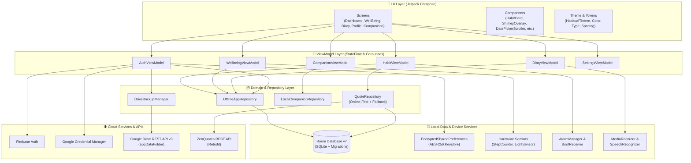
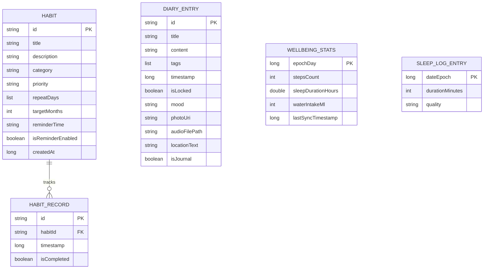

# Habitual — Mindful Rituals & Holistic Wellness Companion

<div align="center">

-3DDC84?style=for-the-badge&logo=android&logoColor=white)


-4285F4?style=for-the-badge&logo=sqlite&logoColor=white)


<p align="center">
  <b>A modern, privacy-first Android application designed to cultivate consistency, nurture physical vitality, foster thoughtful self-reflection, and delight users with animated virtual companions.</b>
</p>

[Key Features](#-key-features) •
[Architecture](#-system-architecture) •
[Tech Stack](#-tech-stack) •
[Getting Started](#-getting-started) •
[Sensors & Permissions](#-permissions--hardware-requirements) •
[Testing](#-testing-suite) •
[Project Structure](#-project-structure)

</div>

---

## 📖 Overview

**Habitual** is a comprehensive personal wellness and habit formation system for Android. Built from the ground up with **Kotlin 2.0** and **Jetpack Compose (Material 3)**, Habitual bridges daily behavioral psychology with modern mobile technology.

Unlike conventional habit trackers that simply check boxes, Habitual treats self-improvement as an integrated lifestyle:
- **Daily Rituals:** Manage and monitor atomic habits with streak calculations, reminder notifications, and consistency analytics.
- **Active Vitality & Sleep Sanctum:** Seamlessly monitor physical activity using real-time on-device hardware sensors (step counter and ambient light sensor) alongside manual and voice-driven logging.
- **Multimedia Journal:** Expressive daily journaling with rich tags, mood tracking, voice recording, geo-tagging, photo attachments, and biometric locks.
- **Virtual Companions:** A gamified mastery system where habit consistency unlocks desktop Shimeji-inspired walking companions that traverse the screen in real-time.
- **Cloud Independence & Privacy:** Fully offline-first local SQLite Room storage paired with user-controlled Google Drive backup to a secure, private app folder (`appDataFolder`).

---

## ✨ Key Features

### 🎯 1. Rituals & Habit Tracking (Dashboard)
* **Custom Habit Definition:** Configure rituals with custom categories (*Health, Study, Personal, Work, Well-being*), priorities (*Low, Medium, High*), target durations (months), and custom repeat days of the week.
* **Chronological Navigation:** Smooth date-scroller (`DatePickerScroller`) to inspect and toggle habits for past, present, or upcoming days.
* **Interactive Completion & Streaks:** Real-time completion toggles with automatic calculation of current streaks and all-time consistency metrics.
* **Consistency Analytics & History Calendar:** Deep-dive habit stats (`HabitStatsScreen`) showing current streak, completion percentages, and interactive visual heatmap calendars (`HistoryCalendar`).
* **Leveling & Gamification:** Gain experience through habit completions. Every 2 completions levels up your mastery profile, unlocking companion tiers.
* **Daily Inspiration:** Dynamic quotes fetched online via **ZenQuotes REST API** with automated fallback to bundled local JSON assets when offline.

### 🌿 2. Active Vitality & Sleep Sanctum (Well-being)
* **Hardware Step Tracking:** Integrates device hardware `Sensor.TYPE_STEP_COUNTER` via `StepSensorManager` for automatic, background-resilient step tracking.
* **Dual-Ring Vitality Meter:** Visual dual-ring circular progress tracking for active movement and step goals.
* **Hydration Counter:** Log daily water intake with one-tap quick increments (+250ml) or custom volumes.
* **Sleep Logging & Quality Assessment:** Log sleep duration and rest quality with intuitive sliders and time pickers.
* **Ambient Light Sensing:** Leverages the device's hardware `Sensor.TYPE_LIGHT` via `LightSensorManager` to assess room brightness (lux) and suggest optimal sleep conditions (< 10 lux).
* **Voice-Activated Logging:** Built-in speech recognition (`SpeechRecognizerManager`) allows hands-free voice logging:
  * *"Logged 2 glasses of water"*
  * *"Logged 8 hours of sleep"*
  * *"Added 1500 steps"*

### 📖 3. Mindful Journal & Diary
* **Rich Journal Entries:** Document thoughts, notes, and milestones with categorized hashtag tags.
* **Mood Tracking:** Record emotional states using expressive emoji indicators (😞, 😐, 🙂, 😄).
* **Audio Voice Notes:** Capture voice notes directly in-app using built-in AAC/M4A `MediaRecorder` with playback controls.
* **Camera & Gallery Attachments:** Capture instant photos or select existing images via Android `ActivityResultContracts` and secure `FileProvider`.
* **Location Tagging:** Pin geographic context to journal entries using GPS / `LocationManager`.
* **Speech-to-Text Dictation:** Dictate journal thoughts hands-free via on-device speech recognition.
* **Biometric & Privacy Lock:** Lock individual private entries behind biometric authentication (fingerprint / face) or app credentials.

### 🐾 4. Gamified Virtual Companions (Shimeji Overlay)
* **Mastery Unlock System:** Progress through mastery levels to unlock unique companions loaded dynamically from JSON asset packs:
  * **Beemo** (*Adventure Sprite*) — Unlocked at Level 1
  * **Marshall Lee** (*Vampire King*) — Unlocked at Level 5
  * **Ezio** (*Master Assassin*) — Unlocked at Level 10
  * **Ford** (*Dimensional Sage*) — Unlocked at Level 15
* **Desktop Shimeji-Style Overlay:** An interactive companion walks along the bottom navigation bar in real time:
  * Sprite physics with edge detection and smart direction turnaround animations.
  * Natural idle animations with configurable stochastic probabilities from `metadata.json`.
  * Non-blocking touch pass-through allowing full interaction with underlying UI components.

### 🔐 5. Security & Authentication
* **Multi-Factor Auth Options:** Email & Password registration via Firebase Authentication, one-tap Google Sign-In using modern **Android Credential Manager**, and biometric fingerprint unlock.
* **Hardware-Backed Encryption:** Stores authentication tokens and sensitive state using **AndroidX EncryptedSharedPreferences** backed by AES-256 GCM / AES-256 SIV encryption and the Android Keystore `MasterKey`.
* **Transactional Account Erasure:** Complete GDPR-compliant user data wipe with atomic SQLite cascade deletions.

### ☁️ 6. Google Drive Cloud Backup & Restore
* **Private Drive AppData:** Utilizes Google Drive REST API v3 targeting the private, user-hidden `appDataFolder` without requesting full Drive filesystem access.
* **Complete State Serialization:** Full backup snapshot (`BackupData`) covering habits, records, diary entries, wellbeing metrics, and sleep logs.
* **Atomic Restore & Collision Management:** Replaces and reconciles existing records cleanly in a single Room database transaction.

### ⏰ 7. Reliable Scheduling & Notifications
* **Exact Habit Alarms:** Schedules daily habit notifications using Android's `AlarmManager` (`RTC_WAKEUP`).
* **Reboot Resilience:** A dedicated `BootReceiver` listens for `ACTION_BOOT_COMPLETED` and automatically reschedules all active alarms from the Room database upon device restart.

### 🎨 8. Premium Minimal Wellness Design System
* **Custom Design Tokens:** Dedicated spacing, radius, elevation, typography, and alpha tokens defined in `HabitualTheme`.
* **Aesthetic Palettes:** Dual-palette support featuring **Forest Green** (nature, calm) and **Crimson Red** (energy, focus) in both dynamic **Light Mode** and **Dark Mode**.
* **Edge-to-Edge Experience:** Clean translucent status and navigation bar styling with adaptive system bar icons.

---

## 🏛 System Architecture

Habitual follows **Clean Architecture** combined with the **MVVM (Model-View-ViewModel)** architectural pattern recommended by Google.



### Architectural Highlights
- **Single Source of Truth (SSOT):** Room database exposes reactive Kotlin `Flow<List<T>>` streams mapped directly into Compose `StateFlow`.
- **Zero-Crash Migrations:** Comprehensive, manually verified SQLite database migration chain (`MIGRATION_1_2` through `MIGRATION_6_7`) ensuring data integrity across app versions.
- **Offline Resilience:** App remains fully functional without an active network connection; external API queries gracefully degrade to local JSON assets.

---

## 🛠 Tech Stack

| Category | Technology | Purpose |
| :--- | :--- | :--- |
| **Language** | [Kotlin 2.0.21](https://kotlinlang.org/) | Modern, expressive, and safe language for Android |
| **UI Framework** | [Jetpack Compose (BOM 2024.02.01 / 2024.09.00)](https://developer.android.com/jetpack/compose) | Declarative reactive UI toolkit |
| **Design System** | [Material Design 3 (Material3 1.2.1)](https://m3.material.io/) | Modern adaptive design components & dynamic color |
| **Navigation** | [Navigation Compose 2.7.7](https://developer.android.com/guide/navigation) | Type-safe screen navigation and backstack handling |
| **Database** | [AndroidX Room 2.8.4](https://developer.android.com/training/data-storage/room) | SQLite abstraction layer with compile-time query verification |
| **Annotation Processing** | [KSP (Kotlin Symbol Processing) 2.0.21-1.0.27](https://kotlinlang.org/docs/ksp-overview.html) | High-performance code generation for Room |
| **Asynchronous Engine** | [Kotlin Coroutines & Flow 1.7.3](https://kotlinlang.org/docs/coroutines-overview.html) | Asynchronous background processing and reactive streams |
| **Networking** | [Retrofit 2.9.0 + Gson](https://square.github.io/retrofit/) | Type-safe REST client for ZenQuotes API |
| **Image Loading** | [Coil Compose 2.5.0](https://coil-kt.github.io/coil/compose/) | Asynchronous, performant image loading and memory caching |
| **Authentication** | [Firebase Auth](https://firebase.google.com/docs/auth) & [Credential Manager 1.3.0](https://developer.android.com/training/sign-in/credential-manager) | Secure modern user authentication and Google Sign-In |
| **Biometrics** | [AndroidX Biometric 1.1.0](https://developer.android.com/training/sign-in/biometric-auth) | Fingerprint and face authentication prompts |
| **Security** | [AndroidX Security-Crypto 1.1.0](https://developer.android.com/topic/security/data) | Hardware-backed encrypted shared preferences |
| **Cloud Storage** | [Google Drive API v3](https://developers.google.com/drive) | User data backup and recovery using `appDataFolder` |
| **Testing** | [JUnit 4](https://junit.org/), [MockK](https://mockk.io/), [Turbine](https://github.com/cashapp/turbine), [UIAutomator](https://developer.android.com/training/testing/other-components/ui-automator) | Unit, Flow, and Instrumented end-to-end integration tests |

---

## 🗄 Database Schema & Migrations

Habitual uses Room Database version **7** (`habitual_database`). All changes across project history are tracked with strict SQL migration scripts:

```
Version 1 ──► Version 2: Added `isLocked` flag to diary_entries
Version 2 ──► Version 3: Added `mood` string to diary_entries
Version 3 ──► Version 4: Added `photoUri`, `audioFilePath`, `locationText` to diary_entries
Version 4 ──► Version 5: Added `isJournal` boolean to diary_entries
Version 5 ──► Version 6: Rebuilt `habit_records` with FOREIGN KEY (CASCADE) and index
Version 6 ──► Version 7: Added composite index on (habitId, timestamp), created `sleep_log_entries` & `wellbeing_stats`
```

### Core Entities



---

## 🚀 Getting Started

### Prerequisites
* **Android Studio:** Ladybug (2024.2.1) / Koala or newer
* **JDK:** Version 11 or higher (OpenJDK 11/17 recommended)
* **Android SDK:** API level 35 installed (Build Tools 35.0.0+)
* **Physical Device or Emulator:** Running Android 8.0+ (API 26+)
  * *Note: Hardware Step Counter and Ambient Light sensing require a physical device or emulator configured with virtual sensors.*

### Installation & Build

1. **Clone the Repository:**
   ```bash
   git clone https://github.com/AimaKoraki/Habitual.git
   cd Habitual
   ```

2. **Configure Firebase & Google Services:**
   * Habitual utilizes Firebase for user authentication and Google Drive for backup.
   * Place your `google-services.json` file inside the `app/` directory:
     ```
     Habitual/
     └── app/
         └── google-services.json
     ```
   * *(Optional)* If configuring Google Sign-In with your own Google Cloud project, update the `googleWebClientId` string in `app/src/main/java/com/aima/habitual/navigation/NavGraph.kt`.

3. **Build the Project with Gradle:**
   ```bash
   # On Windows (PowerShell)
   .\gradlew.bat assembleDebug

   # On macOS / Linux
   ./gradlew assembleDebug
   ```

4. **Install and Run on Connected Device:**
   ```bash
   # On Windows (PowerShell)
   .\gradlew.bat installDebug

   # On macOS / Linux
   ./gradlew installDebug
   ```

---

## 🔒 Permissions & Hardware Requirements

Habitual requests only the permissions strictly required to provide its rich wellness and journaling features:

| Permission | Android Level | Feature / Purpose |
| :--- | :--- | :--- |
| `android.permission.INTERNET` | All | Fetching live quotes from ZenQuotes API, Firebase auth, Google Drive backup |
| `android.permission.ACTIVITY_RECOGNITION` | API 29+ | Reading device hardware step counter sensor (`Sensor.TYPE_STEP_COUNTER`) |
| `android.permission.RECORD_AUDIO` | All | Recording audio voice notes in diary entries and speech-to-text dictation |
| `android.permission.POST_NOTIFICATIONS` | API 33+ | Displaying daily scheduled habit reminders |
| `android.permission.SCHEDULE_EXACT_ALARM` | API 31+ | Exact alarm scheduling for ritual reminder notifications |
| `android.permission.RECEIVE_BOOT_COMPLETED` | All | Automatically restoring all habit alarms when the phone reboots |
| `android.permission.USE_BIOMETRIC` | All | Biometric fingerprint/face prompt for login and locked diary entries |
| `android.permission.ACCESS_FINE_LOCATION` | All | Optional geographic tagging on journal reflections |
| `android.permission.ACCESS_COARSE_LOCATION`| All | Approximate location support for diary metadata |

> [!NOTE]
> All runtime permissions are requested with graceful degradation. If a permission is denied by the user, unaffected features continue operating normally.

---

## 🧪 Testing Suite

The repository contains both isolated unit tests and a comprehensive instrumented UI/E2E test suite:

### 1. Unit & Coroutine Tests
Located under `app/src/test/java/`:
- **`CompanionViewModelTest.kt`**: Validates companion level thresholds, JSON asset parsing, and unlock status updates using `MockK` and `kotlinx-coroutines-test`.
- **`ExampleUnitTest.kt`**: Standard local unit tests.

Run unit tests via command line:
```bash
./gradlew testDebugUnitTest
```

### 2. Instrumented Integration & End-to-End Tests
Located under `app/src/androidTest/java/`:
- **`HabitualEndToEndTest.kt`**: Complete 1,300+ line automated suite testing complete user journeys:
  * Full Authentication Cycle (Registration, Login, Profile updates, Biometrics, Account deletion).
  * Habit Lifecycle (Creation, Date navigation, Streak calculations, Detailed stats view, Editing, Cascading deletion).
  * Journal Workflows (Drafting, Emoji mood selection, Audio/Photo attachment, Biometric locks, Sorting).
  * Health Logging (Step syncing, Sleep logging dialog, Water intake).
  * Navigation integrity across all primary bottom navigation tabs.
- **`HabitDaoTest.kt`**: Direct in-memory Room SQLite testing verifying queries, conflict strategies, cascades, and migrations.
- **`HabitViewModelTest.kt`** & **`WellbeingViewModelTest.kt`**: Instrumented ViewModel tests validating state updates.

Run instrumented tests on an emulator or physical device:
```bash
./gradlew connectedAndroidTest
```

---

## 📁 Project Structure

```
Habitual/
├── app/
│   ├── build.gradle.kts                 # App-level build script & dependency specifications
│   ├── google-services.json             # Firebase configuration file
│   ├── proguard-rules.pro               # ProGuard / R8 code shrinking rules
│   └── src/
│       ├── androidTest/                 # Instrumented UI & Room database integration tests
│       │   └── java/com/aima/habitual/
│       │       ├── HabitualEndToEndTest.kt
│       │       ├── data/HabitDaoTest.kt
│       │       └── viewmodel/
│       ├── test/                        # JVM unit tests (MockK & Coroutines)
│       │   └── java/com/aima/habitual/viewmodel/
│       └── main/
│           ├── AndroidManifest.xml      # Manifest permissions, receivers, and activity definitions
│           ├── assets/                  # Bundled assets (Quotes & Companions)
│           │   ├── fallback_quotes.json
│           │   └── companions/
│           │       ├── companions_list.json
│           │       ├── Beemo/          # Sprite animation frames & metadata
│           │       ├── Ezio/
│           │       ├── Ford/
│           │       └── Marshall_Lee/
│           ├── java/com/aima/habitual/
│           │   ├── MainActivity.kt      # Edge-to-edge entry point, permissions & window size classes
│           │   ├── data/                # Room DB, DAOs, TypeConverters, Repositories
│           │   │   ├── HabitualDatabase.kt
│           │   │   ├── HabitDao.kt
│           │   │   ├── AppRepository.kt
│           │   │   ├── QuoteRepository.kt
│           │   │   └── LocalCompanionRepository.kt
│           │   ├── model/               # Room entities & domain data classes
│           │   │   ├── Habit.kt
│           │   │   ├── HabitRecord.kt
│           │   │   ├── DiaryEntry.kt
│           │   │   ├── WellbeingStats.kt
│           │   │   ├── SleepLogEntry.kt
│           │   │   ├── Companion.kt
│           │   │   ├── StepSensorManager.kt
│           │   │   └── LightSensorManager.kt
│           │   ├── navigation/          # Jetpack Compose navigation graph and screen destinations
│           │   │   ├── NavGraph.kt
│           │   │   └── Screen.kt
│           │   ├── network/             # Retrofit API definitions (ZenQuotes)
│           │   ├── receiver/            # BroadcastReceivers for Alarms & Boot re-registration
│           │   │   ├── ReminderReceiver.kt
│           │   │   └── BootReceiver.kt
│           │   ├── ui/
│           │   │   ├── components/      # Reusable Compose widgets (HabitCard, ShimejiOverlay, etc.)
│           │   │   ├── screens/         # Feature screen composables (Dashboard, Diary, etc.)
│           │   │   └── theme/           # Design tokens, color schemes, typography, and shapes
│           │   ├── utils/               # Helper managers (DriveBackup, Speech, Audio, Passwords)
│           │   └── viewmodel/           # MVVM ViewModels (Habit, Wellbeing, Diary, Auth, etc.)
│           └── res/                     # Drawables, layouts, mipmaps, and string resources
├── gradle/
│   ├── libs.versions.toml               # Gradle Version Catalog for unified dependency versions
│   └── wrapper/                         # Gradle Wrapper binaries and properties
├── build.gradle.kts                     # Root build configuration
├── settings.gradle.kts                  # Project name and repository management
└── README.md                            # Project documentation
```

---

## 🤝 Contributing

Contributions to Habitual are welcome! Whether submitting bug fixes, designing new virtual companions, or proposing features:

1. **Fork the Repository** on GitHub.
2. **Create a Feature Branch:**
   ```bash
   git checkout -b feature/amazing-feature
   ```
3. **Commit Your Changes:**
   ```bash
   git commit -m "feat: Add amazing new wellness widget"
   ```
4. **Push to Your Branch:**
   ```bash
   git push origin feature/amazing-feature
   ```
5. **Open a Pull Request:** Describe the rationale behind the change and include test results or screenshots where applicable.

---

## 📄 License

This project is open source and distributed under the terms of the **[MIT License](LICENSE)**.

---

<div align="center">
  <sub>Built with ❤️ using Kotlin & Jetpack Compose. Inspired by mindful living and digital companion pets.</sub>
</div>
